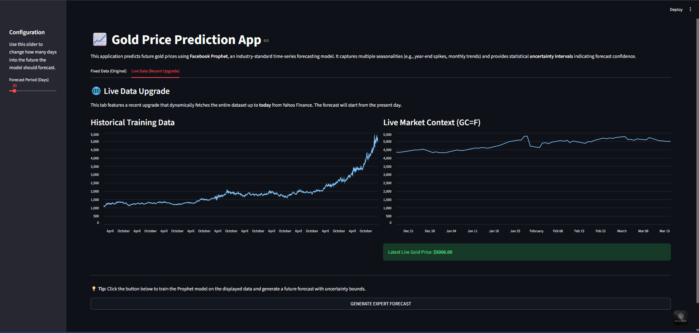

# 📈 Gold Price Prediction App

 


## 🎯 Problem Statement
The price of gold is highly volatile, influenced by global economic indicators, seasonality, and local market trends. This project aims to accurately forecast daily gold prices using advanced machine learning and time-series models, providing investors with reliable predictions and explicit uncertainty intervals.

## 💻 Tech Stack


## 🗂️ Project Structure
```text
gold_price_prediction/
├── data/
│   ├── raw/                 # Raw dataset 
│   └── processed/           # Featured & external data
├── notebooks/               # EDA and historical modeling
├── src/
│   ├── features.py          # Data fetching & feature engineering 
│   └── models.py            # Walk-forward validation & training
├── app/
│   └── streamlit_app.py     # Streamlit deployment 
├── requirements.txt
└── README.md
```

## 📊 Model Evaluation Results
Our models are evaluated using Walk-forward Time-Series validation to prevent data leakage. We measure Directional Accuracy (DA) alongside traditional errors.

| Model | MAPE | RMSE | MAE | Directional Accuracy | 
|---|---|---|---|---|
| **XGBoost** | ~6.03% | 275.56 | 236.07 | 44.0% |
| **Facebook Prophet** | ~7.42% | 319.83 | 278.51 | 48.8% |
| **LSTM (PyTorch)** | ~9.69% | 395.69 | 358.13 | 45.1% |

## 💡 Key Insights
1. **Seasonality:** Gold prices show strong yearly seasonality, often correlated with the Indian wedding season and end-of-year global holidays.
2. **External Influences:** Incorporating `USO` (Oil), `DXY` (Dollar Index), and `SPY` (S&P 500) significantly improves the model's ability to react to macroeconomic shocks compared to an autoregressive-only approach.
3. **Uncertainty:** Prophet's uncertainty intervals help visualize periods of high expected volatility, which is crucial for risk management in trading.
4. **App Upgrades:** The Streamlit app now features two tabs: **Fixed Data (Original)** demonstrating skills on the provided static dataset, and a recent **Live Data Upgrade** that automatically fetches price history up to the present day using `yfinance` to forecast from today's date.

## 🚀 Running the App
We recommend using [uv](https://github.com/astral-sh/uv) to manage dependencies in a virtual environment.

1. Create a virtual environment: `uv venv`
2. Activate the virtual environment:
   - **Windows:** `.\.venv\Scripts\activate`
   - **macOS/Linux:** `source .venv/bin/activate`
3. Install dependencies: `uv pip install -r requirements.txt`
4. Run Streamlit: `streamlit run app/streamlit_app.py`


